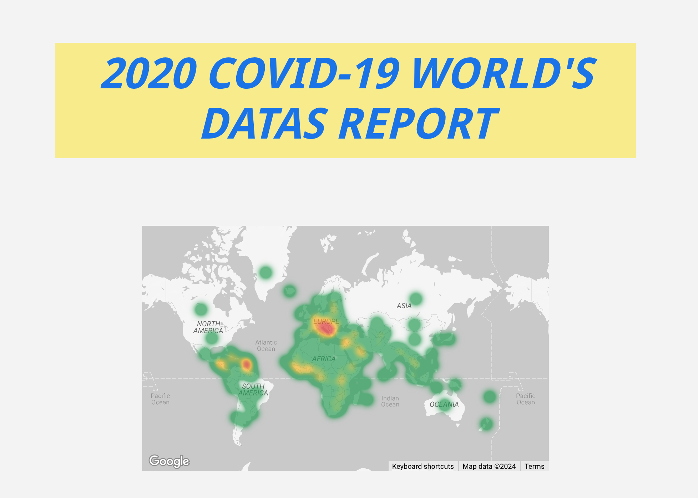

# 2020 COVID-19 Data Analysis
COVID-19 Data Analysis: Analyzing and visualizing global COVID-19 data from 2020. This repository includes data preprocessing, data analysis, and visualizations.
## Overview
This repository is created to the analysis and visualization of COVID-19 data from the year 2020. The goal is to provide insights into the global spread and impact of the pandemic through data-driven analysis and visualizations.
## Link of the project
[Covid19 Report](https://lookerstudio.google.com/s/rZAggHjSedM)

## Data Sources
The data used in this project is sourced from this sources:
- [Kaggle](https://www.kaggle.com/datasets/imdevskp/corona-virus-report)
- [World Health Organization (WHO)](https://data.who.int/dashboards/covid19/cases)
## Features
### Data Preprocessing
- Data normalization and formatting

### Exploratory Data Analysis
- Statistical summary of the data
- Visualizations of trends
- Comparative analysis across different countries

### Trend Analysis
- Time series analysis of COVID-19 cases
- Growth rate
- Identification of significant events and policy impacts

### Geospatial Analysis
- Analysis of regional and local outbreaks
  
## Contact
For questions or suggestions, please contact [zeynep.gokmen@etiya.com](mailto:zeynep.gokmen@etiya.com).

---

*Note: This project is for educational and informational purposes only.*
